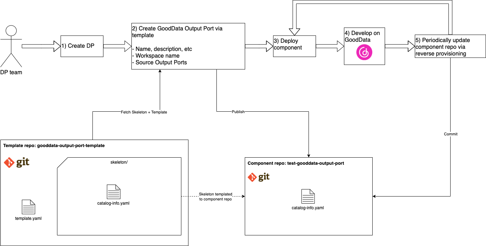
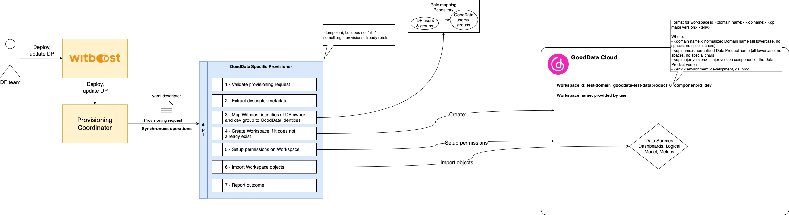
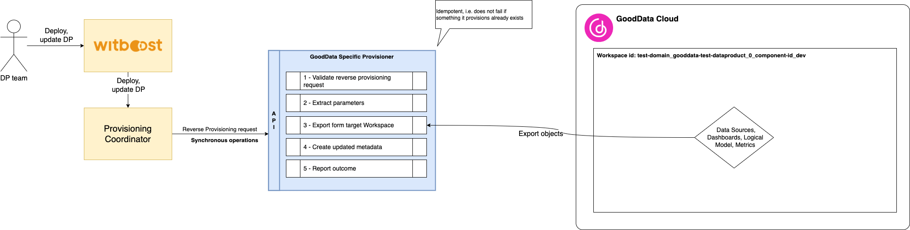
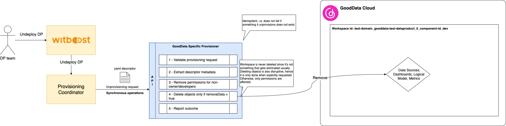
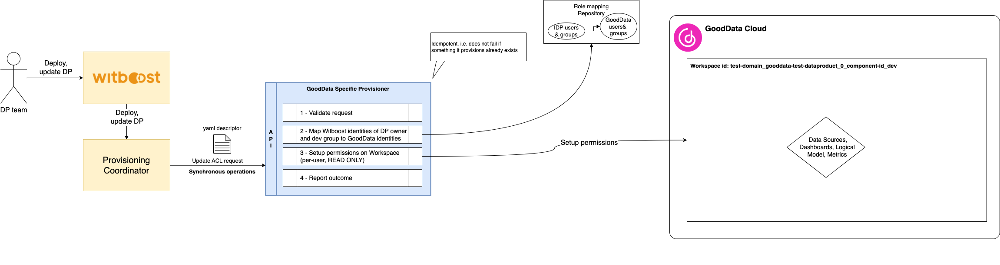

# High Level Design

This document describes the High Level Design of the GoodData Specific Provisioner.
The source diagrams can be found and edited in the [accompanying draw.io file](hld.drawio).

- [Overview](#overview)
- [Workflow](#workflow)
- [Provisioning](#provisioning)
  - [Workspace Provisioning](#workspace-provisioning)
  - [Workspace Reverse Provisioning](#workspace-reverse-provisioning)
- [Update ACL](#update-acl)

## Overview

### Specific Provisioner

A Specific Provisioner (SP) is a service in charge of performing a resource allocation task, usually
through a Cloud Provider. The resources to allocate are typically referred to as the _Component_, the
details of which are described in a YAML file, known as _Component Descriptor_.

The SP is invoked by an upstream service of the Witboost platform, namely the Coordinator, which is in charge of orchestrating the creation
of a complex infrastructure by coordinating several SPs in a single workflow. The SP receives
the _Data Product Descriptor_ as input with all the components (because it might need more context) plus the id of the component to provision, named _componentIdToProvision_

To enable the above orchestration a SP exposes an API made up of six main operations:
- validate: checks if the provided component descriptor is valid and reports any errors
- provision: allocates resources based on the previously validated descriptor; clients either receive an immediate response (synchronous) or a token to monitor the provisioning process (asynchronous)
- reverse provision: inspects target resources based on the parameters provided by the user; the provisioner then answers to the client with either a failure or if successful it provides a new version of the metadata file that can be used to create the target resources
- status: for asynchronous provisioning, provides the current status of a provisioning request using the provided token
- unprovision: destroys the resources previously allocated.
- updateacl: grants access to a specific component/resource to a list of users/groups

### GoodData

[GoodData](https://www.gooddata.com/) is a prominent data analytics and visualization platform designed to help organizations transform raw data into actionable insights. It offers a comprehensive suite of tools that enable users to create, manage, and share insightful analytics dashboards and reports.

GoodData's platform supports a wide range of data sources and provides robust features for data integration, transformation, and enrichment. Its intuitive, user-friendly interface allows business users, analysts, and data scientists to collaborate and explore data effortlessly. With powerful visualization capabilities, GoodData enables users to build interactive, customizable dashboards that provide real-time insights and drive data-driven decision-making.

Additionally, its advanced analytics functions, including machine learning and predictive analytics, help organizations uncover hidden patterns and trends, enhancing their ability to respond to business challenges and opportunities effectively.

## GoodData Specific Provisioner

This Specific Provisioner interacts with a GoodData SaaS account and provisions Output Ports as Workspaces complete with Logical Model, Metrics, Dashboards etc.

### Development Workflow

The lifecycle of a GoodData Output Port component relies on the reverse provisioning operation in Witboost to update the component definition form the current state of the Workspace.

The user first creates a component using the Template in Witboost, which creates a component repository with example code. The user then deploys the component, which creates resources on GoodData. The user can then work as he normally would, editing the objects on the Workspace, and then use the reverse provisioning operation to update the component definition. Thica can then be updated to deploy to other environments, where the user is not allowed edit permissions.

## Output Port Provisioning

The provisioning task creates (if not existent) the Workspace on GoodData based on the received parameters, it then creates the objects specifid by the metadata inside of it.

Workspace provisioning takes care of creating the Workspace and applying permissions to it. The Workspace is named based on the system that contains the components (eg, a Data Product); it is created as follows: `$Domain_$DPName_$MajorVersion`.

The permissions that are applied involve the Owner of the system and the associated Developer Group.

If the Workspace already exists, no creation operation is performed.

After this, the provisioner imports the objects specified in the component metadata (in the `specific.workspaceDefinition` field) using the import API.

### Workspace Reverse Provisioning

Workspace reverse provisioning takes care of updating the component repo with the exported objects from the current state of the Workspace by updating the `catalog-info.yml` file.

The provisioner receives the following parameters as inputs from the user via the reverse provisioning request:
- environment
- workspace name

It then uses the export API to export objects from the Workspace, then outputs uptaed metadata to the client by updating the `specific.workspaceDefinition` field.

## Unprovisioning

Unprovisioning consists of removing the existing resources associated to the components. The Workspace itself is simply deleted.

## Update ACL

Update ACL operation enables the platform to update the permissions on the Workspace/Dashboards whenever a new consumer is granted access. The provisioner receives an update d list of identities to grant access to, and the provisioner applies these grants on GoodData.

